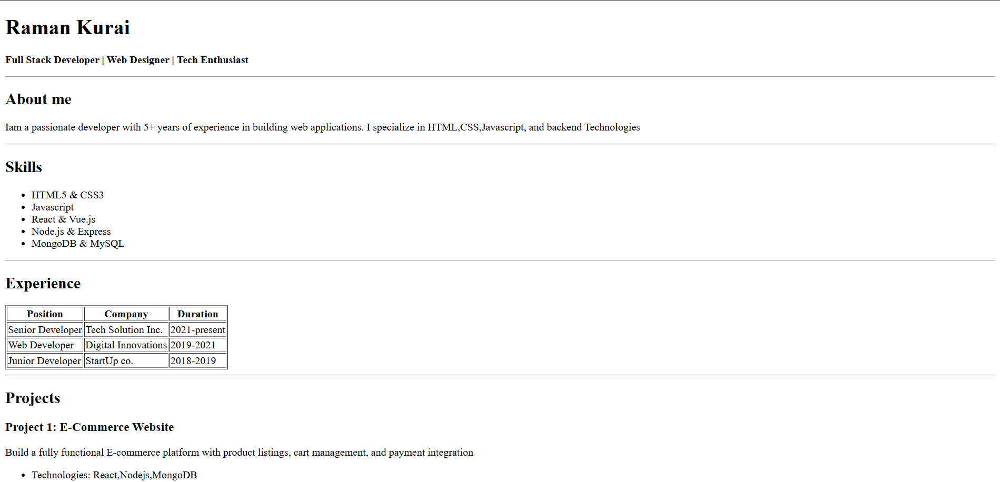
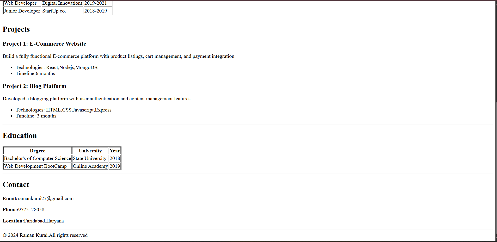

# Portfolio Website (HTML)

This is a simple portfolio website created using pure HTML.

## How I Created This Project

- First, I created a new folder on my system.
- I opened that folder in **VS Code**.
- Inside the folder, I created an `index.html` file.
- I generated the HTML boilerplate using `!` (Emmet).
- Then I built the portfolio using different HTML tags such as:
  - Headings
  - Paragraphs
  - Links
  - Images
  - Lists
  - Tables
  - Semantic tags

## Technologies Used

- HTML5

## Purpose of This Project

- To practice HTML basics
- To understand page structure
- To create my first personal portfolio website

## How to Run This Project

1. Download or clone the repository.
2. Open the `index.html` file in any web browser.

## Here is the screenshot of the live server 

